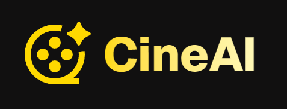
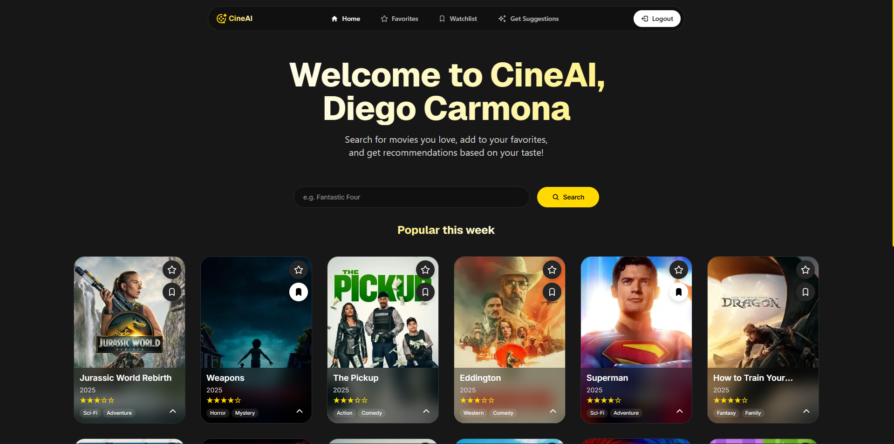
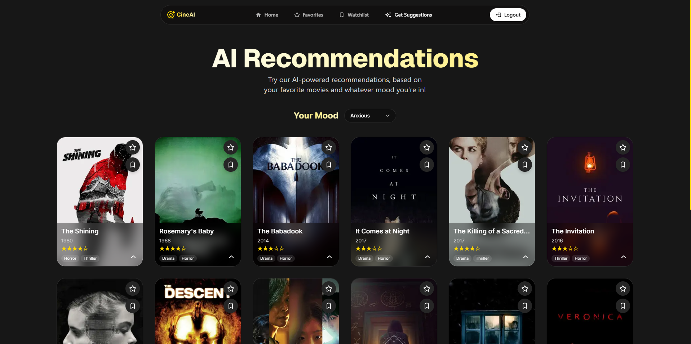
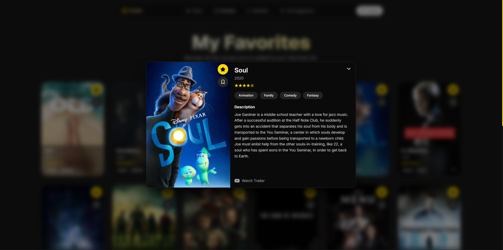
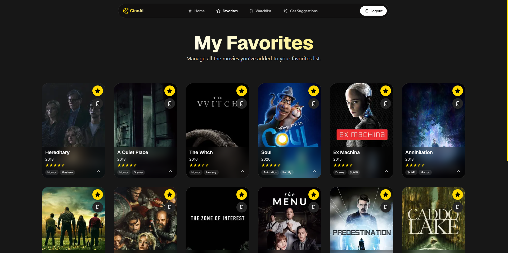

# 

> AI-powered movie discovery platform with personalized recommendations

[](https://nextjs.org/)
[](https://www.typescriptlang.org/)
[](https://www.prisma.io/)
[](https://react.dev/)
[](https://tailwindcss.com/)

**🚀 [Live Demo](https://aicine.vercel.app)**

CineAI is a modern web app that helps you decide what to watch.
Search and save your favorites, build a watchlist, and get AI-powered recommendations based on your taste and even your mood (e.g., Happy, Thoughtful, Scared). Built with cutting-edge web technologies, it offers a seamless experience for movie enthusiasts to discover, organize, and track their favorite films.

## ✨ Features

### 🤖 **AI-Powered Recommendations**

- Personalized movie suggestions based on your favorite movies
- Mood-based recommendations (happy, sad, excited, romantic, etc.)
- Smart algorithm that learns from your preferences
- Powered by Groq's LLaMA models for intelligent suggestions

### 📱 **Movie Management**

- **Favorites System**: Save and organize your favorite movies
- **Watchlist**: Keep track of movies you want to watch
- **Trending Movies**: Discover what's popular right now
- **Movie Search**: Find all your favorite movies

### 🎯 **User Experience**

- **Responsive Design**: Optimized for desktop, tablet, and mobile
- **Dark Theme**: Modern, eye-friendly interface
- **Real-time Updates**: Instant feedback on all interactions
- **Loading States**: Smooth UX with proper loading indicators
- **Error Handling**: Graceful error states and recovery

### 🔐 **Authentication & Data**

- Secure Google OAuth integration via Auth.js
- Persistent user data with PostgreSQL
- Data consistency across all devices
- Privacy-focused user management

## 🛠️ Tech Stack

### **Frontend**

- **[Next.js 15.4.5](https://nextjs.org/)** - React framework with App Router
- **[React 19.1](https://reactjs.org/)** - UI library with latest features
- **[TypeScript 5](https://www.typescriptlang.org/)** - Type-safe development
- **[Tailwind CSS 4](https://tailwindcss.com/)** - Utility-first styling
- **[React Icons 5.5](https://react-icons.github.io/react-icons/)** - Icon library

### **Backend & Database**

- **[Prisma 6.13](https://www.prisma.io/)** - Type-safe database ORM
- **[PostgreSQL](https://www.postgresql.org/)** - Robust relational database
- **[Auth.js 5.0](https://authjs.dev/)** - OAuth Authentication solution
- **Next.js API Routes** - Serverless backend functions

### **External APIs**

- **[TMDB API](https://www.themoviedb.org/documentation/api)** - Movie database and metadata
- **[Groq API](https://groq.com/)** - AI-powered movie recommendations
- **Google OAuth** - Secure user authentication

### **Development Tools**

- **[ESLint](https://eslint.org/)** - Code linting and quality
- **[Prettier](https://prettier.io/)** - Code formatting
- **[Git](https://git-scm.com/)** - Version control

## 📸 Screenshots

### Home Page - Movie Discovery



_Clean, modern interface for discovering trending movies_

### AI Recommendations



_Personalized suggestions based on your favorites and mood_

### Movie Details



_Comprehensive movie information with trailers and actions_

### Favorites & Watchlist



_Organize your movie collection with ease_

## 🚀 Getting Started

### Prerequisites

- Node.js 18+ and npm
- PostgreSQL database
- TMDB API key
- Groq API key
- Google OAuth credentials

### Installation

1. **Clone the repository**

   ```bash
   git clone https://github.com/diegocarmn/cineai.git
   cd cineai
   ```

2. **Install dependencies**

   ```bash
   npm install
   ```

3. **Set up environment variables**

   ```bash
   cp .env.example .env.local
   ```

   Fill in your environment variables:

   ```env
   # Database
   DATABASE_URL="postgresql://..."

   # Authentication
   NEXTAUTH_URL="http://localhost:3000"
   NEXTAUTH_SECRET="your-secret-key"
   GOOGLE_CLIENT_ID="your-google-client-id"
   GOOGLE_CLIENT_SECRET="your-google-client-secret"

   # APIs
   TMDB_KEY="your-tmdb-api-key"
   GROQ_API_KEY="your-groq-api-key"
   ```

4. **Set up the database**

   ```bash
   npx prisma migrate dev
   npx prisma generate
   ```

5. **Run the development server**

   ```bash
   npm run dev
   ```

6. **Open your browser**
   Navigate to [http://localhost:3000](http://localhost:3000)

## 🏗️ Project Structure

```
cineai/
├── app/                     # Next.js App Router
│   ├── (app)/               # Protected app routes 
│   │   ├── favorites/       # Favorites management
│   │   ├── watchlist/       # Watchlist page
│   │   ├── home/            # Main discovery page
│   │   └── get-suggestions/ # AI recommendations
│   ├── (public)/            # Public routes / Landing page
│   ├── api/                 # API routes 
│   │   ├── auth/            # Authentication
│   │   ├── ai/              # AI recommendations
│   │   ├── favorite/        # Favorites API
│   │   └── search/          # Movie search
│   ├── components/          # Reusable components
│   └── lib/                 # Utility functions
├── prisma/                  # Database schema & migrations
├── public/                  # Static assets
└── types/                   # TypeScript definitions
```

## 🔄 API Routes

| Endpoint         | Method      | Description                 |
| ---------------- | ----------- | --------------------------- |
| `/api/auth/*`    | GET/POST    | Authentication with Auth.js |
| `/api/search`    | GET         | Search movies via TMDB      |
| `/api/trending`  | GET         | Get trending movies         |
| `/api/ai`        | GET         | AI-powered recommendations  |
| `/api/favorite`  | POST/DELETE | Manage favorites            |
| `/api/watchlist` | POST/DELETE | Manage watchlist            |

## 📝 License

This project is licensed under the MIT License. See the [LICENSE](LICENSE) file for the full license text.

## 📧 Contact

Diego Carmona - [@diegocarmn](https://www.linkedin.com/in/diegocarmn/)

Project Link: [https://github.com/diegocarmn/cineai](https://github.com/diegocarmn/cineai)

---

<div align="center">
  <strong>Made with ❤️ and a good playlist</strong>
</div>
